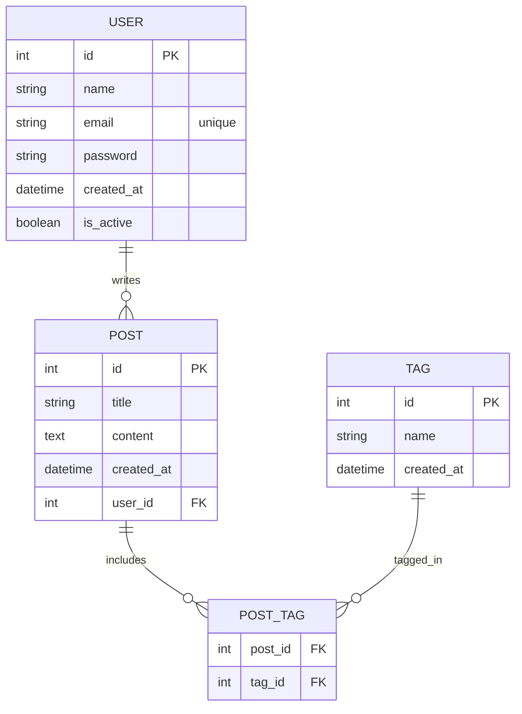

# 문제 2

아래의 요구 사항에 맞는 테이블을 설계하여 ERD를 작성해 주세요

기초 테이블 정의를 바탕으로 작성하며,
유저스토리에 따라 테이블의 수정 및 추가를 하실 수 있습니다
## 기초 테이블 정의

- **user** table은 이름(name), 이메일(email), 패스워드(password), 가입일(created_at)을 가지고 있다.
- **post** table은 글제목(title), 본문(content), 글 작성일(created_at), 작성자(user_id)를 가지고 있다
- **tag** table은 태그명(name), 태그 생성일(created_at)을 가지고있다

### 유저 스토리

- user는 post를 작성할수 있다
- user는 post는 복수의 tag를 추가 할수있다
- user는 탈퇴처리 처리가 가능해야한다
- user가 탈퇴 되더라도, post는 삭제되서는 안된다
- tag로 post를 검색할수 있어야 한다

---

### 💡 추가질문 - 성능을 개선하기 위한 아이디어를 제시해 주세요

### 1. 요구사항 분석

**기초 테이블 정의**

- **user 테이블:**
    - 컬럼: 이름(name), 이메일(email), 패스워드(password), 가입일(created_at)
- **post 테이블:**
    - 컬럼: 글제목(title), 본문(content), 글 작성일(created_at), 작성자(user_id)
- **tag 테이블:**
    - 컬럼: 태그명(name), 태그 생성일(created_at)

**유저 스토리**

- 사용자는 **post를 작성**할 수 있음 → *user와 post는 1:N 관계*
- post에는 **복수의 tag**를 추가할 수 있음 → *post와 tag는 다대다(M:N) 관계 (별도의 연결 테이블 필요)*
- 사용자는 **탈퇴 처리**가 가능해야 함
    - 단, 탈퇴 시에도 post는 삭제되지 않아야 함
    - 이를 위해 user 테이블에는 탈퇴 여부(예: is_active 또는 status) 컬럼을 추가하거나, 실제 삭제 대신 **소프트 딜리트**(flag 처리)를 고려할 수 있음
- tag를 이용하여 post를 **검색할 수** 있어야 함
    - 다대다 관계를 통해 특정 태그에 연결된 모든 포스트를 쉽게 조회할 수 있도록 함

### 2. 테이블 설계 및 ERD

1. **User 테이블**
    - **id** (PK)
    - **name**
    - **email** (유니크 제약조건)
    - **password**
    - **created_at**
    - **is_active** (또는 status): 사용자의 활성/탈퇴 여부 표시
2. **Post 테이블**
    - **id** (PK)
    - **title**
    - **content**
    - **created_at**
    - **user_id** (FK → User.id)
3. **Tag 테이블**
    - **id** (PK)
    - **name**
    - **created_at**
4. **Post_Tag (연결 테이블)**
    - **post_id** (FK → Post.id)
    - **tag_id** (FK → Tag.id)
    - 복합 기본키 (post_id, tag_id)를 사용하여 중복 연결 방지

ERD 다이어그램 (Mermaid 형식)

이 ERD에서 볼 수 있듯,

- **User와 Post**: 한 명의 사용자가 여러 게시글을 작성할 수 있습니다.
- **Post와 Tag**: 게시글은 여러 태그와 연결되며 태그 또한 여러 게시글에 연결될 수 있으므로 중간에 **Post_Tag** 테이블(연결 테이블)을 사용합니다.
- **사용자 탈퇴 처리**: user 테이블에 탈퇴 여부(is_active)를 추가하여 사용자가 탈퇴되어도 기존 post는 유지할 수 있도록 합니다.

### 3. 성능 개선 아이디어

- **인덱스 최적화:**
    - 이메일(email) 컬럼에 유니크 인덱스 생성
    - 포스트의 작성일(created_at) 및 사용자 외래키(user_id)에 인덱스를 추가하여 조회 성능 개선
    - 태그 이름(name) 및 연결 테이블(POST_TAG)의 post_id, tag_id에 인덱스를 생성
- **캐싱 전략:**
    - 자주 조회되는 게시글이나 태그 검색 결과는 Redis 같은 인메모리 데이터베이스를 사용해 캐싱
    - 태그별 게시글 목록 같은 복잡한 조인 쿼리 결과를 캐시해 응답 속도를 높임
- **쿼리 최적화:**
    - 다대다 조인에서 필요한 컬럼만 선택하도록 쿼리를 최적화
    - 검색 조건에 맞는 부분 인덱스 또는 복합 인덱스 사용
- **분산 처리 및 파티셔닝:**
    - 데이터 양이 많은 경우, 게시글 테이블을 생성일 기준으로 파티셔닝하여 검색 및 집계 성능 개선
- **소프트 딜리트 방식 활용:**
    - 사용자 탈퇴 처리를 실제 삭제 대신 플래그로 관리함으로써, 탈퇴한 사용자의 데이터와 게시글 간의 관계를 유지하면서도, 활성 사용자만을 대상으로 한 쿼리 최적화 가능
- **추가 고려 사항**
  - 태그 관리 방식에 따른 다른 설계가 필요 할 수도 있습니다 (자유로운 해시태그,강제된 해시태그)
  - 태그 검색 방식에 대한 고민 추가 정규식등을 활용한 단순비교일 경우와 부분검색/형태소 분석 과 관련된 추가 검색이 필요할 경우에는 FULLTEXT인덱스 혹은 ElasticSearch가 필요 할거 같습니다.
