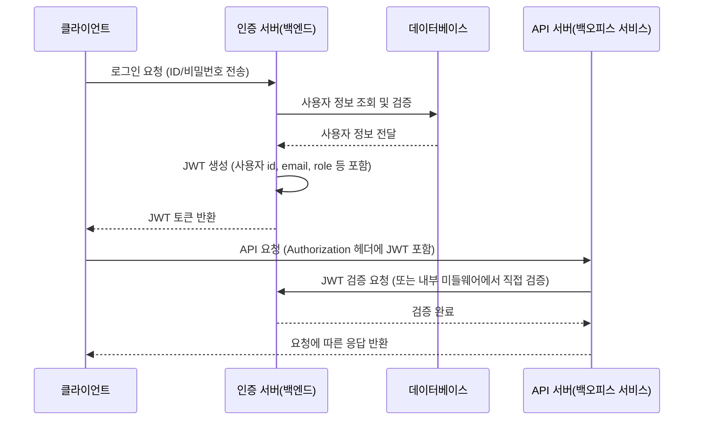

# 문제 3

사내에서 쓰이는 BO(Back office) 서비스를 개발하려고 합니다.


# 사내 BO(Back Office) 서비스 개발 계획

## 1. 로그인방식인 OAuth와 JWT 둘중에 어느것을 사용하여 개발을 하실건가요?

**JWT(JSON Web Token)를 선택합니다.**

### 선택 이유:

- **MVP 출시 우선**
  - 현재 서비스 규모가 크지 않아 빠른 MVP 출시가 필요
  - JWT는 구현이 단순하고 빠르기 때문에 초기 개발 및 배포에 유리

- **구조의 단순성**
  - JWT는 별도의 인증 서버 없이 백엔드에서 토큰을 직접 발급하고 검증 가능
  - 복잡한 OAuth의 토큰 교환 및 리다이렉션 과정이 불필요

- **사내 직접 통제**
  - BO 서비스는 사내 사용자 및 권한 관리가 직접 이루어짐
  - JWT를 사용하면 사용자 등록, 권한 부여, 토큰 만료 및 갱신 등의 관리가 명확

- **시간과 리소스 절약**
  - OAuth는 외부 인증 제공자 연동, 추가 인프라 등으로 복잡성 증가
  - JWT는 최소한의 개발로 인증 시스템을 완성할 수 있어 스타트업 환경에 적합

## 2. 둘중 선택한 이유와 장점에 대해 설명해주세요.

### 빠른 MVP 출시와 단순한 구현

- **MVP 우선 전략**
  - 초기 서비스 규모가 작고, 빠른 출시와 시장 반응 확인이 중요
  - 별도의 인증 서버나 복잡한 리다이렉션 로직 없이 바로 백엔드에 통합 가능

  스타트업 환경에서는 시장에 빠르게 진입하여 사용자 피드백이 중요합니다. JWT는 최소한의 개발 노력으로 안전한 인증 시스템을 구축할 수 있게 해줍니다. 특히 제가 사용한 NestJS와 같은  프레임워크에서는 JWT 통합이 매우 간단하게 이루어졌습니다.

  ```typescript
  // NestJS에서 JWT 설정 예시
  @Module({
    imports: [
      JwtModule.register({
        secret: 'yourSecretKey',
        signOptions: { expiresIn: '1h' },
      }),
    ],
    providers: [AuthService],
    controllers: [AuthController],
  })
  export class AuthModule {}
  ```

- **개발 속도 향상**
  - OAuth에 비해 기본적인 사용자 인증 흐름이 단순하여 개발 기간 단축
  

### 구조의 단순성

- **내부 시스템에 적합**
  - 사용자 정보(ID, 이메일, 권한 등)를 토큰에 포함시켜 직접 발급 및 검증
  - 복잡한 토큰 교환이나 외부 인증 제공자 연동이 불필요한 사내 BO 시스템에 적합

  JWT는 자체적으로 필요한 모든 정보를 포함할 수 있는 토큰입니다. 헤더(알고리즘 및 토큰 유형), 페이로드(클레임), 서명의 세 부분으로 구성되어 있습니다. 사내 백오피스 시스템에서는 사용자의 역할(role)이나 권한(permission) 정보를 토큰에 직접 포함시켜, API 요청마다 데이터베이스 조회 없이도 권한 검증이 가능합니다.

  ```javascript
  // JWT 페이로드 예시
  {
    "sub": "1234567890",
    "name": "김영희",
    "email": "younghee.kim@company.com",
    "role": "admin",
    "permissions": ["users:read", "users:write", "reports:read"],
    "department": "마케팅",
    "iat": 1516239022,
    "exp": 1516242622
  }
  ```

- **코드 및 유지보수 용이성**
  - 구조가 단순하여 코드 이해도와 유지보수가 쉬움
  - 버그 발생 시 신속한 수정 가능

  JWT 인증 로직은 일반적으로 미들웨어로 구현되어, 서비스 코드와 완전히 분리될 수 있습니다. 이는 관심사 분리(Separation of Concerns) 원칙을 따르는 것으로, 코드의 가독성과 유지보수성을 크게 향상시킵니다.

  예를 들어, Express.js에서는 단 몇 줄의 코드로 JWT 인증 미들웨어를 구현할 수 있습니다

  ```javascript
  const jwt = require('jsonwebtoken');

  function authenticateToken(req, res, next) {
    const authHeader = req.headers['authorization'];
    const token = authHeader && authHeader.split(' ')[1];
    
    if (token == null) return res.sendStatus(401);
    
    jwt.verify(token, process.env.TOKEN_SECRET, (err, user) => {
      if (err) return res.sendStatus(403);
      req.user = user;
      next();
    });
  }
  ```

### 사내 직접 통제 및 관리

- **사용자 및 권한 관리**
  - 사내 사용자만 접근하는 환경에서 사용자 등록, 권한 부여, 토큰 관리를 내부에서 직접 수행
  - 제어권이 명확함

  사내 BO 시스템에서는 사용자 관리가 중앙집중식으로 이루어집니다. 인사 변동이나 역할 변경 시 즉시 권한을 조정할 수 있어야 합니다. JWT를 사용하면 새로운 역할이나 권한 정보로 새 토큰을 발급하는 것만으로도 이러한 변경을 빠르게 적용할 수 있습니다.

  역할 기반 접근 제어(RBAC)를 구현하면 각 사용자의 역할에 따라 시스템 접근 권한을 세밀하게 제어할 수 있습니다.

  ```typescript
  // NestJS에서 JWT와 Guards를 활용한 RBAC 구현 예시
  @Injectable()
  export class RolesGuard implements CanActivate {
    constructor(private reflector: Reflector) {}

    canActivate(context: ExecutionContext): boolean {
      const requiredRoles = this.reflector.getAllAndOverride<string[]>('roles', [
        context.getHandler(),
        context.getClass(),
      ]);
      if (!requiredRoles) {
        return true;
      }
      const { user } = context.switchToHttp().getRequest();
      return requiredRoles.some((role) => user.roles?.includes(role));
    }
  }
  ```

- **즉각적인 대응**
  - 보안 이슈나 인증 관련 문제 발생 시 내부 시스템에서 바로 대응 가능

  보안 이슈가 발생했을 때 JWT는 몇 가지 방법으로 빠르게 대응할 수 있습니다
  1. 토큰 만료 시간(expiration time)을 짧게 설정하여 피해 범위 제한
  2. 서명 키(signing key)를 변경하여 모든 기존 토큰 무효화
  3. JWT 블랙리스트를 구현하여 특정 토큰만 무효화

  예를 들어, Redis를 사용한 JWT 블랙리스트 구현
  ```javascript
  const redis = require('redis');
  const client = redis.createClient();

  // 토큰 블랙리스트에 추가 (로그아웃 또는 보안 이슈 발생 시)
  async function blacklistToken(token, expiryTimeInSeconds) {
    await client.setEx(`blacklist:${token}`, expiryTimeInSeconds, 'true');
  }

  // 토큰 검증 시 블랙리스트 확인
  async function isTokenBlacklisted(token) {
    return await client.get(`blacklist:${token}`) !== null;
  }
  ```

### 시간과 리소스 절약

- **추가 인프라 비용 최소화**
  - 최소한의 리소스로 구현 가능하여 초기 개발 비용과 인력 소요 감소

  OAuth 2.0 구현은 일반적으로 다음과 같은 추가 인프라와 개발 작업이 필요합니다
  1. 별도의 인증 서버 설정 및 유지
  2. 클라이언트 등록 및 관리 메커니즘
  3. 토큰 교환 및 새로고침 로직
  4. 리다이렉션 URL 관리
  5. 인가 코드 및 액세스 토큰 저장소

  반면, JWT는 서버에 개인 키와 공개 키 쌍만 관리하면 되므로 인프라 요구사항이 매우 단순합니다. 서버리스 아키텍처에서도 쉽게 구현할 수 있어 클라우드 비용을 최소화할 수 있습니다.

- **간결한 개발 프로세스**
  - 개발팀이 인증 로직에 집중할 수 있고, 복잡한 서드파티 통합 없이 빠르게 서비스 출시 가능

  개발자가
  JWT를 이해하고 구현하는 데 필요한 학습 곡선이 상대적으로 낮습니다. 대부분의 프로그래밍 언어와 프레임워크에서 JWT 라이브러리를 쉽게 찾을 수 있으며, 문서화가 잘 되어 있어 개발자가 빠르게 습득할 수 있습니다.

  또한, JWT는 JSON 형식을 기반으로 하므로 프론트엔드와 백엔드 간의 통합이 원활합니다. 프론트엔드 개발자는 localStorage나 HttpOnly 쿠키에 토큰을 저장하고, 요청 헤더에 포함시키는 간단한 작업만으로 인증 시스템을 활용할 수 있습니다.

### 보안과 확장성 측면

- **보안 기능 내장**
  - 서명(Signature) 방식으로 토큰의 위변조 방지
  - 만료 시간(expiration) 설정을 통한 보안성 강화

  JWT는 HMAC 알고리즘(HS256) 또는 RSA 공개/개인 키 쌍(RS256)을 사용하여 토큰의 무결성을 보장합니다. 특히 RS256과 같은 비대칭 암호화 방식을 사용하면, 토큰 발급(서명)은 개인 키로만 가능하고 검증은 공개 키로 할 수 있어 보안성이 높아집니다.

  ```javascript
  // RS256을 사용한 JWT 생성 예시
  const jwt = require('jsonwebtoken');
  const fs = require('fs');

  // 개인 키  (토큰 발급용)
  const privateKey = fs.readFileSync('private.key');
  
  // 액세스 토큰 생성
  function generateAccessToken(user) {
    return jwt.sign(user, privateKey, { 
      algorithm: 'RS256',
      expiresIn: '15m'  // 짧은 만료 시간 설정
    });
  }
  
  // 리프레시 토큰 생성 (더 긴 만료 시간)
  function generateRefreshToken(user) {
    return jwt.sign(user, privateKey, { 
      algorithm: 'RS256',
      expiresIn: '7d'
    });
  }
  ```

- **향후 확장 용이**
  - 초기에는 간단한 JWT 기반 인증을 사용하더라도, 필요에 따라 Refresh Token, RBAC(역할 기반 접근 제어) 등 확장 가능

  서비스가 성장함에 따라 인증 시스템도 함께 발전해야 합니다. JWT 기반 인증은 다음과 같은 방식으로 확장할 수 있습니다

  1. **Refresh Token 도입**: 짧은 수명의 액세스 토큰과 긴 수명의 리프레시 토큰을 함께 사용하여 보안성과 사용자 경험 사이의 균형을 맞출 수 있습니다.

  2. **다중 인증(MFA) 통합**: JWT 페이로드에 인증 레벨 정보를 포함시켜, 중요한 작업에는 추가 인증을 요구할 수 있습니다.

  3. **마이크로서비스 아키텍처 지원**: JWT는 상태를 저장하지 않는(stateless) 특성으로 인해 여러 서비스 간에 인증 정보를 쉽게 공유할 수 있습니다.

  4. **Single Sign-On(SSO) 구현**: 중앙 인증 서비스에서 발급된 JWT를 여러 내부 애플리케이션에서 활용하여 SSO를 구현할 수 있습니다.

## 3. 구현 방법

### JWT 기반 인증 구현 방법

#### 구현 개요

1. **로그인 요청 처리**
   - 클라이언트가 ID/비밀번호를 포함한 로그인 요청(POST /auth/login) 전송

   이 단계에서는 클라이언트가 사용자 자격 증명을 안전하게 서버로 전송합니다. HTTPS를 통해 통신이 이루어져야 하며, 입력 검증을 통해 잠재적인 주입 공격을 방지해야 합니다.

   ```typescript
   // 로그인 요청 DTO
   export class LoginDto {
     @IsEmail()
     email: string;

     @IsString()
     @MinLength(8)
     password: string;
   }

   // 컨트롤러 메소드
   @Post('login')
   async login(@Body() loginDto: LoginDto) {
     return this.authService.login(loginDto);
   }
   ```

2. **사용자 검증**
   - 백엔드에서 데이터베이스의 사용자 정보를 조회하고 비밀번호 검증

   이 단계에서는 제공된 자격 증명을 검증합니다. 비밀번호는 bcrypt와 같은 해시 알고리즘을 사용하여 저장되고 비교되어야 합니다.

   ```typescript
   async validateUser(email: string, password: string): Promise<any> {
     const user = await this.usersService.findOneByEmail(email);
     if (user && await bcrypt.compare(password, user.password)) {
       const { password, ...result } = user;
       return result;
     }
     return null;
   }
   ```

3. **JWT 생성 및 반환**
   - 사용자 검증 성공 시, 사용자 정보를 포함한 JWT 생성하여 클라이언트에게 반환
   - 토큰은 서명을 통해 위변조 방지, 만료시간 설정

   인증이 성공하면 액세스 토큰과 필요에 따라 리프레시 토큰을 생성합니다. 토큰에는 사용자 ID, 역할, 권한 등의 정보가 포함될 수 있습니다.(필요할 경우 조금더 다양한 정보를 담을 수 있으나 이로인해 payload가 무거워 질 수도 있음)

   ```typescript
   async login(user: any) {
     const payload = { 
       sub: user.id, 
       email: user.email,
       name: user.name,
       role: user.role,
       permissions: user.permissions
     };
     
     return {
       access_token: this.jwtService.sign(payload, { expiresIn: '15m' }),
       refresh_token: this.jwtService.sign({ sub: user.id }, { expiresIn: '7d' })
     };
   }
   ```

4. **API 요청 시 토큰 검증**
   - 클라이언트는 API 요청 시 JWT를 HTTP 헤더(Authorization: Bearer {token})에 포함
   - 백엔드에서 JWT 검증 후 요청 처리

   토큰이 유효한지, 만료되지 않았는지, 서명이 올바른지 확인하고, 요청한 리소스에 접근할 권한이 있는지 확인합니다.

   ```typescript
   // JWT 인증 가드
   @Injectable()
   export class JwtAuthGuard implements CanActivate {
     constructor(private jwtService: JwtService) {}

     async canActivate(context: ExecutionContext): Promise<boolean> {
       const request = context.switchToHttp().getRequest();
       const token = this.extractTokenFromHeader(request);
       if (!token) {
         throw new UnauthorizedException();
       }
       
       try {
         const payload = await this.jwtService.verifyAsync(token);
         // 토큰 페이로드에서 사용자 정보를 요청 객체에 추가
         request['user'] = payload;
       } catch {
         throw new UnauthorizedException();
       }
       return true;
     }

     private extractTokenFromHeader(request: Request): string | undefined {
       const [type, token] = request.headers.authorization?.split(' ') ?? [];
       return type === 'Bearer' ? token : undefined;
     }
   }

   // 컨트롤러에서 가드 사용
   @UseGuards(JwtAuthGuard)
   @Get('profile')
   getProfile(@Request() req) {
     return req.user;
   }
   ```

#### 구현 다이어그램



#### 구현 세부 사항

- **JWT 라이브러리 사용**
  - Node.js: `jsonwebtoken` 패키지
  - NestJS: `@nestjs/jwt` 모듈

  ```typescript
  // NestJS에서 JWT 모듈 설정
  @Module({
    imports: [
      JwtModule.registerAsync({
        imports: [ConfigModule],
        inject: [ConfigService],
        useFactory: async (configService: ConfigService) => ({
          secret: configService.get<string>('JWT_SECRET'),
          signOptions: { 
            expiresIn: configService.get<string>('JWT_EXPIRES_IN', '15m'),
            algorithm: 'RS256'
          },
          verifyOptions: {
            algorithms: ['RS256']
          }
        }),
      }),
    ],
    providers: [AuthService, JwtStrategy],
    exports: [AuthService],
  })
  export class AuthModule {}
  ```

- **토큰 저장 위치**
  - 클라이언트: HttpOnly, Secure 쿠키를 사용하여 XSS 공격 방지

  ```javascript
  // 서버에서 HttpOnly 쿠키 설정
  res.cookie('access_token', token, {
    httpOnly: true,
    secure: process.env.NODE_ENV === 'production',
    sameSite: 'strict',
    maxAge: 15 * 60 * 1000 // 15분
  });
  ```

  추가적으로 CSRF(Cross-Site Request Forgery) 공격을 방지하기 위한 조치도 필요합니다

  ```typescript
  // CSRF 보호 설정
  app.use(csurf({ cookie: true }));

  // CSRF 토큰 제공
  app.get('/csrf-token', (req, res) => {
    res.json({ csrfToken: req.csrfToken() });
  });
  ```

- **보안 강화**
  - 토큰 서명 알고리즘(HS256 또는 RS256) 선택
  - 토큰 만료 시간 및 필요시 Refresh Token 도입
  - RBAC(역할 기반 접근 제어)를 통한 세밀한 사용자 권한 관리

  **Refresh Token**: 액세스 토큰의 수명을 짧게(15분) 유지하고, 리프레시 토큰을 사용하여 새 액세스 토큰을 발급받는 방식입니다. 리프레시 토큰은 데이터베이스에 저장하고 필요시 무효화할 수 있어, 토큰 탈취 시 피해를 최소화할 수 있습니다.(해당 방법외에도 앞서 언급한 Redis에서의 TTL을 설정하여 RDB가 아닌 Redis에서도 관리가 가능합니다. 아래에서는 우선 RDB에 저장 했을 경우를 가정하고 코드를 작성했습니다.)

  ```typescript
  // 리프레시 토큰 엔드포인트
  @Post('refresh')
  async refresh(@Body() body: { refresh_token: string }) {
    try {
      // 리프레시 토큰 검증
      const decoded = this.jwtService.verify(body.refresh_token);
      
      // 토큰이 데이터베이스에 있고 유효한지 확인
      const storedToken = await this.tokenRepository.findOne({
        userId: decoded.sub,
        token: body.refresh_token,
        revoked: false
      });
      
      if (!storedToken) {
        throw new UnauthorizedException('Invalid refresh token');
      }
      
      // 사용자 정보 조회
      const user = await this.usersService.findById(decoded.sub);
      
      // 새 액세스 토큰 발급
      return this.authService.login(user);
    } catch (e) {
      throw new UnauthorizedException('Invalid refresh token');
    }
  }
  ```

  **RBAC 구현**: 각 API 엔드포인트나 리소스에 필요한 역할이나 권한을 정의하고, JWT 페이로드에 포함된 역할/권한 정보를 통해 접근 제어를 구현합니다.

  ```typescript
  // 역할 기반 접근 제어를 위한 데코레이터
  export const Roles = (...roles: string[]) => SetMetadata('roles', roles);

  // 역할 가드
  @Injectable()
  export class RolesGuard implements CanActivate {
    constructor(
      private reflector: Reflector,
      private jwtService: JwtService
    ) {}

    canActivate(context: ExecutionContext): boolean {
      const requiredRoles = this.reflector.getAllAndOverride<string[]>('roles', [
        context.getHandler(),
        context.getClass(),
      ]);
      
      if (!requiredRoles) {
        return true;
      }
      
      const request = context.switchToHttp().getRequest();
      const user = request.user;
      
      return requiredRoles.some((role) => user.role === role);
    }
  }

  // 컨트롤러에서 역할 가드 사용
  @UseGuards(JwtAuthGuard, RolesGuard)
  @Roles('admin')
  @Get('admin-dashboard')
  getAdminDashboard() {
    // 관리자만 접근 가능한 리소스
    return { data: 'Admin dashboard data' };
  }
  ```

### 💡 추가질문 - 실제로 구현해본 경험이 있다면, 해당 구현 경험을 서술해주세요

- 제가 참여했던 프로젝트들 중 대부분은 초기 스타트업 환경에서 빠른 MVP 출시와 효율적인 내부 관리 시스템 구축이 핵심 과제였습니다. 특히 내부 백오피스 시스템의 경우, 사용자 인증과 권한 관리에서 보안성과 확장성이 중요한 고려사항으로 떠올랐습니다. 이에 따라 저는 JWT(JSON Web Token) 기반 인증 시스템을 도입하여, 간결하면서도 강력한 보안 메커니즘을 구현한 경험이 있습니다.

예를 들어, 한 프로젝트에서는 영어 LMS 구축 및 내부 백오피스 개발을 전적으로 담당하며 백엔드와 DevOps 역할을 100% 수행했습니다. 이 프로젝트에서는 교육 프로그램 운영과 함께, 내부 관리 시스템을 통해 사용자 데이터와 각종 문제생성을 처리해야 했습니다. JWT를 활용한 인증 방식은 별도의 외부 인증 서버나 복잡한 리다이렉션 절차 없이 백엔드 내에서 토큰 발급 및 검증을 직접 처리할 수 있게 해주어, 신속한 개발 및 배포가 가능했습니다.

구현 과정에서 NestJS 프레임워크를 활용해 JWT 모듈을 통합하고, 액세스 토큰과 리프레시 토큰을 조합하여 보안성을 강화했습니다. 액세스 토큰의 만료 시간을 짧게 설정해 보안을 높였으며, 장기 유효한 리프레시 토큰은 Redis와 같은 인메모리 데이터베이스로 관리하여 토큰 재발급 및 블랙리스트 처리를 더욱 효율적으로 수행할 수 있었습니다. 이러한 접근 방식은 내부 사용자들의 역할 기반 접근 제어(RBAC) 구현에도 큰 도움이 되어, 각 사용자가 자신의 역할에 따라 안전하게 시스템에 접근할 수 있도록 했습니다.

또한, 도커(Docker)를 활용한 컨테이너 기반 배포와 GitHub Actions를 이용한 CI/CD 파이프라인 구축 경험을 바탕으로 시스템을 신속하게 배포하고 업데이트할 수 있었습니다. 이러한 자동화 덕분에 서비스 다운타임을 최소화하고, 실시간 모니터링 및 장애 대응 체계를 마련할 수 있었습니다. 실제로 내부 백오피스 자동화 시스템 구축 프로젝트에서는 React 기반 엑셀 생성 시스템을 도입해 수작업 데이터 입력 시간을 평균 30분에서 5분으로 단축하는 등, 업무 효율성과 정확도를 크게 개선했습니다.

이러한 경험을 통해, JWT 기반 인증 시스템이 단순한 구조와 빠른 구현 시간으로 스타트업 환경 및 내부 시스템에 매우 적합하다는 확신을 갖게 되었습니다.

제가 참여했던 프로젝트들의 상세한 이력과 백오피스 구축 경험은 제 이력서를 통해 확인하실 수 있습니다. 이러한 경험들은 제가 단순히 기술적 구현에 그치지 않고, 실제 서비스 운영 및 배포 환경에서 발생할 수 있는 다양한 문제들을 신속하고 효율적으로 해결할 수 있는 역량을 키워준 중요한 과정이었습니다.

결과적으로, JWT 기반 인증 시스템 도입과 내부 백오피스 자동화 구축은 보안, 효율성, 확장성을 모두 고려한 전략이었으며, 그 결과 서비스의 운영 안정성과 사용자 만족도를 크게 향상시키는 성과로 이어졌습니다.
